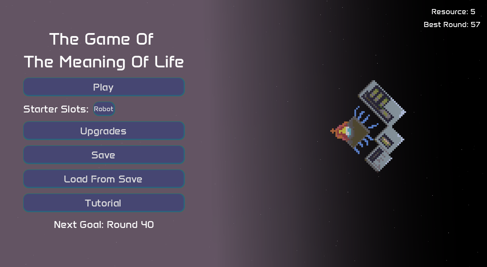
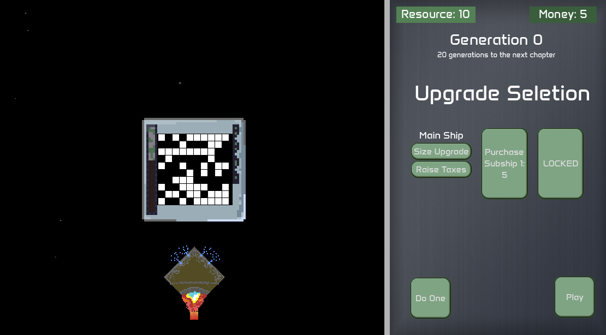
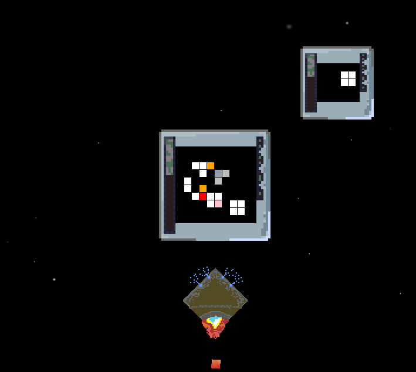

# \# The Game Of The Meaning Of Life

# Itch Link To Play: https://nicholastillo.itch.io/the-game-of-the-meaning-of-life

# 

# The fully automated Titan's Wake carries 32934 human explorers to the edge of the universe. Generations and generations pass as the human race fights against extinction, for one purpose: The search of the Meaning Of Life 

# 

# You will take the role of the Titan's Wake, managing the populations, their professions, resources and more, upgrading the ship with every failed attempt. This is a twist on John Conway's Game Of Life, expanding on its rules, and transforming it from a 0-player game into a fully fledged sci-fi survival/arcade experience. In this game you will attempt to make it to increasingly further generations as random events cause chaos for your plans.

# 

# This is my largest project to date, with me learning aseprite to create all the assets, and setting up a full game workflow. I created all of the code, most of the assets, and did all of the designing. 

# 

# Photos: 

